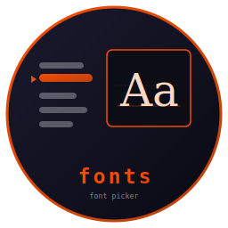

# fonts



    

A TUI font picker with **live previews**. Browse every font installed on your
system, see the highlighted family rendered in its own typeface, and get the
chosen family + point size back. Built to be launched as a picker by another
TUI, exactly like [prism](https://github.com/isene/prism) is for colours. Part
of the [Fe2O3](https://github.com/isene/fe2o3) Rust terminal suite.

<br clear="left"/>

## How it works

`fonts` shells out to [glyph](https://github.com/isene/glyph) (the rasterizer):
`glyph --list` enumerates every `.ttf`/`.otf` under `/usr/share/fonts`,
`~/.fonts`, and `~/.local/share/fonts` in one fast pass, and
`glyph --preview FONT SIZE TEXT` renders the preview that
[glow](https://github.com/isene/glow) draws inline (kitty / sixel). So the
picker is a thin, fast TUI; the heavy lifting is in glyph.

## Usage

```bash
fonts                 # browse; prints the picked font on Enter
fonts --out=FILE      # write the result to FILE (for scribe/grid/…)
fonts --size 14       # start at 14 pt
fonts "DejaVu Serif"  # preselect a family
```

On **Enter** it emits (to `--out` FILE or stdout):

```
family=DejaVu Serif
size=14
path=/usr/share/fonts/truetype/dejavu/DejaVuSerif.ttf
```

On **Esc** it writes nothing and exits non-zero, so a caller can tell a pick
from a cancel.

## Keys

| Key | Action |
|-----|--------|
| `↑` `↓` / `PgUp` `PgDn` | move through the list |
| `Shift+↑` `Shift+↓` | change the point size |
| type / `Backspace` | filter by family name |
| `Ctrl-U` | clear the filter |
| `Enter` | pick |
| `Q` / `Esc` / `Ctrl-C` | quit |

## As a picker (the prism pattern)

Another TUI launches `fonts --out=FILE`, restores its own screen, then reads
the family and size from `FILE`. For example, [scribe](https://github.com/isene/scribe)
binds `\F` to wrap a Visual selection in
`<span style="font-family:'…'; font-size:…pt">`, which survives a Markdown /
HTML save and exports to docx / odt / pdf with the font intact.

## Install

```bash
# From a release (Linux/macOS, x86_64/aarch64)
chmod +x fonts-* && mkdir -p ~/bin && mv fonts-linux-x86_64 ~/bin/fonts

# Or build from source (needs the sibling crust/glow crates alongside)
for r in crust glow fonts; do git clone https://github.com/isene/$r; done
cd fonts && cargo build --release
```

Requires [glyph](https://github.com/isene/glyph) on `PATH`.

## License

Public domain ([Unlicense](https://unlicense.org)).
